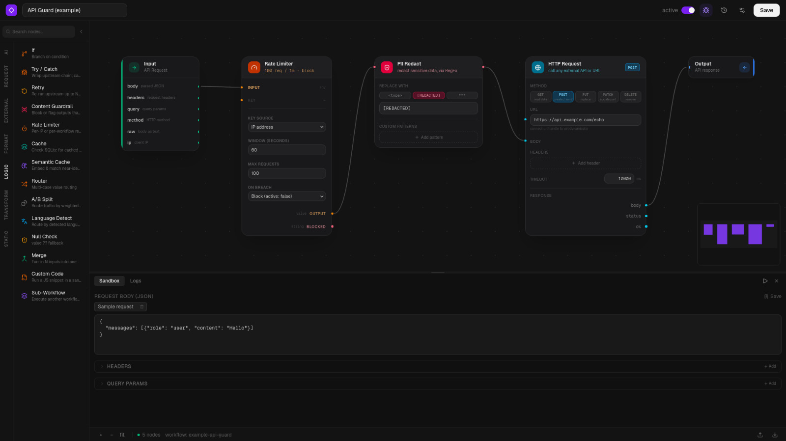

# Sooket

**Build API middleware on a canvas — and run it inline in the request path.**

[](LICENSE.md)
[](https://github.com/danilopatrial/sooket/actions/workflows/test.yml)


Sooket is a visual canvas for building the logic that sits *between* a caller and
your API — rate limiting, auth checks, PII redaction, caching, LLM calls,
request/response shaping — without writing a service to host it. You drag nodes,
connect them, and expose the pipeline as a single HTTP endpoint. Every request
runs through the graph **synchronously** and gets a response back.



## Why

Every API eventually needs a layer of glue in front of it: throttle abusive
callers, strip PII before it hits a third party, cache expensive responses,
validate a token, fan a request out to an LLM. Today that glue is either
hand-written middleware you have to build, test, and deploy, or it lives in an
automation tool like n8n/Zapier — which run *asynchronously*, after the fact, and
can't shape the response a caller is waiting on.

Sooket is the missing middle. It's a visual editor whose output is a live HTTP
endpoint: the graph executes *in* the request path and returns the result to the
caller. No separate service, no async queue, no cloud account — it runs as a
single Next.js process against a local SQLite file on your own machine.

## Quickstart

Requires **Node ≥ 22** (uses the built-in `node:sqlite`); npm ships with Node.
Check what you have with `node -v` — it should print `v22` or newer.

**Don't have Node, or on an older version?** Install or upgrade it first:

- **macOS / Linux (recommended — [nvm](https://github.com/nvm-sh/nvm)):**

  ```bash
  curl -o- https://raw.githubusercontent.com/nvm-sh/nvm/v0.40.1/install.sh | bash
  # reopen your terminal, then:
  nvm install 22 && nvm use 22       # picks up the repo's .nvmrc with `nvm use`
  ```

- **Windows:** install [nvm-windows](https://github.com/coreybutler/nvm-windows)
  (`nvm install 22 && nvm use 22`), or grab the LTS installer from
  [nodejs.org](https://nodejs.org).

- **Any platform without a version manager:** download the LTS installer from
  [nodejs.org](https://nodejs.org).

Confirm with `node -v` (≥ v22) and `npm -v`, then continue:

```bash
git clone https://github.com/danilopatrial/sooket.git
cd sooket
npm run setup                        # handles the sharp/Node 26 prebuilt-binary issue
npm run build
npm start                            # -> http://localhost:3000
```

`npm run setup` installs without running the failing `sharp` native build (it has
no prebuilt binary for Node 26+ yet); on Node 22 a plain `npm install` also works.

First run auto-creates `.env.local` with a random `ENCRYPTION_SECRET` (used to
encrypt stored provider keys and variables at rest). To customize, edit that file
or set `ENCRYPTION_SECRET` in your environment before starting — either overrides
the generated default.

Or with Docker:

```bash
ENCRYPTION_SECRET=$(openssl rand -hex 32) docker compose up
# -> http://127.0.0.1:3000
```

Open `http://localhost:3000`, build a workflow on the canvas, and create an
`sk-wf-*` API key for it from the workflow's settings.

> Working on Sooket itself? `npm run dev` runs the same app with hot reload.

> **Security:** Sooket's management API has **no per-user login** by design — it
> binds to `127.0.0.1` only. To expose it, either set `SOOKET_AUTH_TOKEN` (a shared
> secret that gates the dashboard + management API) or front it with a reverse
> proxy that adds auth + TLS. See [Security](#security).

## A real example, already on your canvas

A fresh install ships with one workflow — **API Guard (example)** — so there's
something to open and inspect on first run. Go to
`http://localhost:3000/workflow` and open it:

```
Input -> Rate Limiter -> PII Redact -> HTTP Request -> Output
```

It puts rate limiting and PII redaction in front of an upstream API without
touching that API's code: callers over the limit are rejected before any work
happens, PII is scrubbed before the request is forwarded, and the upstream
response comes back through the same endpoint.

It ships **inactive** and the HTTP Request node points at a placeholder URL. To
run it for real: point that node at your API, toggle the workflow **active**, and
call it with its `sk-wf-*` key (a "Default Key" is already created for it):

```bash
curl -X POST http://localhost:3000/api/v1/chat \
  -H "Authorization: Bearer sk-wf-xxxxxxxxxxxx" \
  -H "Content-Type: application/json" \
  -d '{"email": "ada@example.com", "note": "call me at 555-123-4567"}'
```

> Deleted it? It won't come back — the example is seeded once and never re-added.

## Features

Verified and shipping today:

| Area | What's there |
|---|---|
| **Visual canvas** | React Flow editor with auto-insert-into-edge, per-node config panels, live sandbox testing |
| **45 nodes** | AI, request, external, format, logic, transform, and static node families (see below) |
| **Inline execution** | `POST /api/v1/chat` runs the graph synchronously and returns the result |
| **Webhooks** | Token-gated `/api/webhooks/[slug]` endpoint per workflow (POST/GET/PUT/PATCH) |
| **Per-workflow API keys** | `sk-wf-*` keys with scopes, rate-limit overrides, expiry, and 30-day usage stats |
| **Encrypted secrets** | AES-GCM + PBKDF2 for provider keys, credentials, and customer variables |
| **Versioning** | Every save snapshots nodes/edges (capped at 50); restore any previous version |
| **Observability** | Per-request and per-node execution logs, paginated execution history |
| **Standalone runtime** | Optional execution server (`npm run execution-server`) sharing the same SQLite file |
| **Self-hosted** | Single process + local SQLite; Docker Compose included; no cloud, no external services |

Node families (45 total):

- **AI** — Token Counter, Complexity Score, Sentiment, Anthropic, Prompt Compression
- **Request** — Output, Response Builder, List Manager, Access List, Auth Validator
- **External** — HTTP Request, Vector Upsert, Vector Search, Webhook, Sub-Workflow
- **Format** — JSON Parser, JSON Builder, XML ↔ JSON, Template String
- **Logic** — If, Try/Catch, Retry, Content Guardrail, Rate Limiter, Cache, Semantic
  Cache, Router, A/B Split, Language Detect, Null Check, Merge, Custom Code
- **Transform** — Type Cast, Concat, Array Length, Pick, Date/Time, String Ops,
  Regex Replace, Math, Size Of, PII Redact
- **Static** — Boolean, Text, Number

## How it works

A workflow is stored as `nodes` + `edges` JSON in SQLite. The request flow is:

1. A caller sends `POST /api/v1/chat` with a `Bearer sk-wf-*` key.
2. Sooket resolves the key to its workflow.
3. The workflow engine walks the node graph recursively (rate limit, redact,
   HTTP, LLM, and so on), memoising each handle so it's computed once per request.
4. The Output node's result is returned to the caller in the same response.

Engine internals live in `lib/workflow-engine.ts`; node executors are registered
by type + version in `lib/nodes/registry.ts`. See [docs/](docs/) for getting
started, configuration, and API usage guides, and [AGENTS.md](AGENTS.md) for the
full architecture. Per-node reference docs and examples are coming.

## Sooket vs n8n / Make / Zapier

The core difference is *when* the logic runs relative to the request.

| | **Sooket** | n8n / Make / Zapier |
|---|---|---|
| Execution model | **Inline / synchronous** — in the HTTP request path | Async / background, event-triggered |
| Shapes the caller's response? | Yes — returns the graph's output | No — fires after the fact |
| Primary use | API middleware (auth, rate limit, redact, cache, LLM) | Workflow automation between SaaS apps |
| Latency profile | Adds to request latency (it *is* the request) | Decoupled from any single request |
| Hosting | Self-hosted single process + SQLite | Mostly cloud / hosted runners |

They solve different problems. Reach for an automation tool when you're wiring
SaaS events together in the background; reach for Sooket when something needs to
happen *during* a request and return a response.

## Security

Sooket's management API (the canvas and every `/api/workflows`, `/api/credentials`,
`/api/provider-keys`, `/api/variables` route) has **no per-user login** and binds
to `127.0.0.1` only. Unless you enable the shared-secret gate, anyone who can reach
the port can read or modify every workflow and exfiltrate provider keys.

- `npm run dev`, `npm start`, the execution server, and `docker compose up` all
  bind/publish to loopback only.
- The execution routes (`/api/v1/chat`, `/api/webhooks/[slug]`) are gated by
  per-workflow keys/tokens and send CORS headers; set `CORS_ORIGIN` to pin the
  allowed origin if you expose them.

### Exposing Sooket safely

If you must reach Sooket over a network, do **one** of the following — do not just
widen the bind address and leave it open:

1. **Shared-secret gate (built in).** Set `SOOKET_AUTH_TOKEN` to a long random
   value (e.g. `openssl rand -hex 32`). Every management request must then present
   it as `Authorization: Bearer <token>`; the dashboard prompts once at `/unlock`
   and stores an httpOnly cookie. The execution API, webhooks, and `/api/health`
   keep their own auth and stay reachable. This is a single shared password, not
   multi-user accounts.
2. **Authenticating reverse proxy.** Put Sooket behind a proxy that adds
   authentication and TLS.

If Sooket is bound to a non-loopback host (`SOOKET_HOST`) **without**
`SOOKET_AUTH_TOKEN`, it prints a loud startup warning.

See the configuration knobs (`SOOKET_HOST`, `SOOKET_AUTH_TOKEN`, `CORS_ORIGIN`,
`SOOKET_MAX_BODY_BYTES`) in [.env.example](.env.example).

## Contributing

Contributions are welcome under a Contributor License Agreement. See
[CONTRIBUTING.md](CONTRIBUTING.md) and [CLA.md](CLA.md). Run `npm run lint` and
`npm test` before opening a PR.

## License

Sooket is **source-available** under the
[Functional Source License, Version 1.1, MIT Future License](LICENSE.md)
(`FSL-1.1-MIT`): free to use, modify, and self-host for any purpose *except*
offering it as a competing commercial product — and each release automatically
becomes MIT-licensed two years after it ships.
